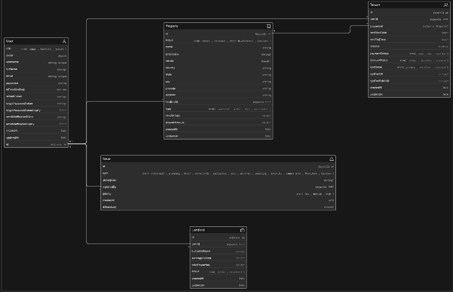

# Tenant Management System Backend

Production-ready backend API for managing landlords, tenants, properties, and related operations in a multi-role rental workflow.

This project is designed for teams building real estate or rental management products that need a clean, scalable backend foundation with practical production concerns already considered: Redis caching support, Dockerized runtime, structured logging, and modular service architecture.

## 1. Project Overview

The Tenant Management System backend provides a centralized API for landlord and tenant workflows.

It is built for:
- SaaS products in property and rental management
- Internal tools for landlords and property managers
- Backend-first teams that want a maintainable Node.js architecture

Core capabilities include:
- Authentication and token-based access control
- Role-aware user operations (tenant, landlord, admin)
- Property and tenant lifecycle management
- Issue/maintenance tracking flows
- Media upload support for profile/property assets
- Caching and containerized deployment support for production environments

## 2. Features

- Tenant, landlord, and user profile management
- Property CRUD workflows with occupancy and status handling
- Tenant assignment and unassignment to properties
- JWT-based authentication with access and refresh tokens
- Password reset and email-based account actions
- Input validation pipeline using centralized validators
- File upload handling with Multer and Cloudinary integration
- Redis integration for cache-ready service optimization
- Structured logging with environment-specific transports
- Docker and Docker Compose support for consistent deployments
- Health check endpoint for uptime and orchestration probes

## 3. Tech Stack

| Layer | Technology |
|---|---|
| Backend | Node.js, Express |
| Database | MongoDB with Mongoose |
| Caching | Redis (`redis` client) |
| DevOps | Docker, Docker Compose |
| Authentication | JWT (`jsonwebtoken`) |
| Validation | `express-validator` |
| File Uploads | Multer |
| Media Storage | Cloudinary |
| Email | Nodemailer, Mailgen |
| Logging | Winston |

## 4. Project Structure

```text
.
├── documentation/
│   ├── MODELS.md                # Data model documentation
│   └── ROUTES.md                # API route documentation
├── logs/                        # Runtime logs (production logger target)
├── public/                      # Static assets served by Express
├── src/
│   ├── app.js                   # Express app setup and route mounting
│   ├── index.js                 # Application bootstrap (DB + Redis + HTTP server)
│   ├── config/                  # Environment and configuration mapping
│   ├── controllers/             # HTTP controller handlers
│   ├── db/                      # Database connection bootstrapping
│   ├── middlewares/             # Auth, upload, validation, and request middleware
│   ├── models/                  # Mongoose schemas and models
│   ├── routes/                  # Versioned API route definitions
│   ├── services/                # Business logic and orchestration layer
│   ├── utils/                   # Shared utilities (logger, redis, response wrappers)
│   └── validators/              # Request validation rules
├── docker-compose.yml           # Multi-service local/prod-style orchestration
├── Dockerfile                   # Production image build
├── package.json
└── README.md
```

## 5. Database & System Design

### Database Schema Diagram

<!-- Add your schema diagram here -->


### System Architecture Diagram

<!-- Add your system architecture diagram here -->


## 5.1 Redis Caching Strategy

This backend uses Redis as a performance layer on top of MongoDB for high-read endpoints.

### Why Redis is used here

- Reduce repeated database reads for frequently requested resources
- Improve response latency for dashboard and list-style endpoints
- Offload query pressure from MongoDB under concurrent traffic
- Keep the API stateless and horizontally scalable with shared cache

### Strategy used in this project

The project follows a cache-aside pattern:

1. Read request checks Redis first
2. On cache miss, data is fetched from MongoDB
3. Fresh data is written to Redis with TTL
4. Write/update/delete flows explicitly invalidate impacted keys

This is implemented through utility methods in `src/utils/redis.js` and key builders in `src/constants/cache.constants.js`.

### Key pattern used

Keys are namespaced and built as:

`<entity>:<identifier>:<id>`

Examples from the current codebase:

- `tenant:getOneTenant:<userId>`
- `tenant:getAllTenants:<propertyId>`
- `tenant:getActiveTenantsByProperty:<propertyId>`
- `property:getOneProperty:<propertyId>`
- `property:getAllProperties:<landlordId>`
- `landlord:getOneLandlord:<landlordId>`
- `landlord:getAllLandlords:<adminId>`

Entity prefixes come from `CacheEntities` and operation/id segments come from `CacheIdentifiers`.

### TTL policy

- `TENANT_TTL = 3600` seconds
- `PROPERTY_TTL = 3600` seconds
- `LANDLORD_TTL = 3600` seconds

Current policy is a uniform 1-hour TTL per entity group (defined in `CacheTTL`).

### Cache invalidation pattern

Invalidation is done on mutation paths using `deleteDataFromRedis(key)`.

Current behavior includes:

- Property mutations invalidate property detail and/or property list keys
- Tenant assignment/removal invalidates tenant detail and property-tenant list keys
- Tenant KYC updates invalidate cached tenant detail

This gives a dual protection model:

- Active invalidation on writes for immediate consistency
- TTL expiry as a fallback cleanup mechanism

### Redis availability behavior

If Redis is unavailable or not ready:

- Reads return `null` and continue to MongoDB
- Writes/deletes are skipped with warning logs
- API continues operating (degraded mode) without hard-failing user requests

This keeps reliability high while still benefiting from caching when Redis is healthy.

## 6. Environment Variables

Create a `.env` file in the project root (you can start from `.env.example`).

| Variable | Required | Description | Example |
|---|---|---|---|
| `NODE_ENV` | Yes | Runtime mode (`development` or `production`) | `development` |
| `PORT` | Yes | Port used by the API server | `4000` |
| `BASE_URL` | Yes | Base server URL used in logs and callbacks | `http://localhost` |
| `CORS_ORIGIN` | Yes | Allowed CORS origins (comma-separated) | `http://localhost:3000` |
| `MONGO_URI` | Yes | MongoDB connection string | `mongodb://localhost:27017/tms` |
| `REDIS_URL` | Recommended | Full Redis URL; preferred for Docker/production | `redis://redis:6379` |
| `REDIS_HOST` | Conditional | Redis host (used when `REDIS_URL` is not set) | `localhost` |
| `REDIS_PORT` | Conditional | Redis port (used when `REDIS_URL` is not set) | `6379` |
| `REDIS_PASSWORD` | Optional | Redis password for secured environments | `your_redis_password` |
| `ACCESS_TOKEN_SECRET` | Yes | Secret for signing access tokens | `super-secret-access-key` |
| `ACCESS_TOKEN_EXPIRY` | Yes | Access token expiry duration | `1d` |
| `REFRESH_TOKEN_SECRET` | Yes | Secret for signing refresh tokens | `super-secret-refresh-key` |
| `REFRESH_TOKEN_EXPIRY` | Yes | Refresh token expiry duration | `7d` |
| `GMAIL_SMTP_HOST` | Yes | SMTP host for outgoing mail | `smtp.gmail.com` |
| `GMAIL_SMTP_PORT` | Yes | SMTP port | `465` |
| `GMAIL_SMTP_USERNAME` | Yes | SMTP username/email | `your-email@gmail.com` |
| `GMAIL_APP_PASSWORD` | Yes | App password for SMTP auth | `your-app-password` |
| `RESET_PASSWORD_REDIRECT_URL` | Yes | Frontend URL for reset-password flow | `http://localhost:3000/reset-password` |
| `CLOUDINARY_CLOUD_NAME` | Yes | Cloudinary cloud name | `your-cloud-name` |
| `CLOUDINARY_API_KEY` | Yes | Cloudinary API key | `your-api-key` |
| `CLOUDINARY_API_SECRET` | Yes | Cloudinary API secret | `your-api-secret` |

Notes:
- In Docker Compose, set `REDIS_URL=redis://redis:6379` so the app resolves Redis using the Compose service name `redis`.
- For external Redis providers, use provider-issued TLS URL and credentials.

## 7. Local Development Setup

### 1. Clone the repository

```bash
git clone https://github.com/NallyTHEdude/TMS_Server.git
cd TMS_Server
```

### 2. Install dependencies

```bash
npm install
```

### 3. Configure environment

```bash
cp .env.example .env
```

Update `.env` with valid MongoDB, Redis, JWT, mail, and Cloudinary values.

### 4. Start development server

```bash
npm run dev
```

The API will run on:

```text
http://localhost:<PORT>
```

## 8. Docker Setup

This project ships with:
- A `Dockerfile` for building a production image
- A `docker-compose.yml` that orchestrates the backend app and Redis

### How docker-compose works here

- `app` service: builds and runs the Node.js API container
- `redis` service: runs Redis (`redis:7-alpine`) on port `6379`
- `depends_on`: ensures Redis container starts before the app service
- `env_file`: loads runtime env vars from `.env`

### Service communication details

Within Docker Compose, containers communicate over an internal network using service names as DNS hostnames.

That means your backend should connect to Redis with:

```env
REDIS_URL=redis://redis:6379
```

Here, `redis` is the service name (not localhost).

### Build and run

```bash
docker compose up --build -d
```

View logs:

```bash
docker compose logs -f app
```

Stop services:

```bash
docker compose down
```

## 9. API Usage

Example: health check endpoint

### Request

```http
GET /api/v1/health
Host: localhost:4000
```

### Example response

```json
{
	"statusCode": 200,
	"data": {
		"message": "Server is healthy and is running"
	},
	"message": "Success"
}
```

You can find full model and route docs in:
- [documentation/MODELS.md](documentation/MODELS.md)
- [documentation/ROUTES.md](documentation/ROUTES.md)

## 10. Production Setup

### Environment configuration

- Set `NODE_ENV=production`
- Use managed services for MongoDB and Redis
- Inject secrets using your platform secret manager (not hardcoded env files in images)

### Redis strategy (`REDIS_URL`)

- Prefer a single full connection string via `REDIS_URL`
- Keep `REDIS_HOST`, `REDIS_PORT`, and `REDIS_PASSWORD` as fallback for custom deployments
- Use password-protected and, when available, TLS-enabled Redis endpoints

### Scaling considerations

- Run multiple API replicas behind a reverse proxy/load balancer
- Keep API instances stateless (JWT + shared DB/cache already supports this)
- Tune connection pools for MongoDB and Redis based on traffic
- Add readiness/liveness probes using `/api/v1/health`

### Logging and error handling

- Winston logger is environment-aware:
- Development: colored console output
- Production: structured logs written to `logs/app.log`
- Centralize logs in your deployment platform (for example, ELK/Datadog/Cloud logging)
- Ensure unhandled exceptions/rejections are captured and alerted

### Security basics

- Rotate JWT and SMTP credentials regularly
- Restrict `CORS_ORIGIN` to trusted frontend domains
- Enforce HTTPS at the edge (reverse proxy / load balancer)
- Apply rate limiting and request throttling at API gateway or middleware layer
- Validate and sanitize all request payloads (already aligned with validator middleware usage)

## 11. Future Improvements

- Add comprehensive API documentation with OpenAPI/Swagger
- Add unit/integration tests and CI pipeline enforcement
- Add rate limiting and abuse protection middleware
- Add distributed tracing and metrics dashboards
- Introduce background job processing for email/reminder workflows
- Expand payment integration for rent collection lifecycle

---

If you contribute new routes or models, update:
- [documentation/ROUTES.md](documentation/ROUTES.md)
- [documentation/MODELS.md](documentation/MODELS.md)
